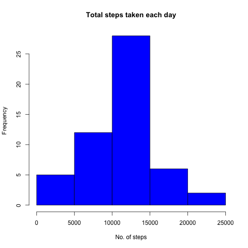

Activity Monitor
========================================================

Lets set the global options here


Check file exists


```r
zipfile <- file.path(getwd(), "repdata-data-activity.zip")

if (!file.exists(zipfile)) {
        url <- "https://d396qusza40orc.cloudfront.net/repdata%2Fdata%2Factivity.zip"
        
        download.file(url, zipfile, method="curl")
        dateDownloaded <- date()
        
        ## unzip file, saves as 'activity.csv'
        f <- unzip(zipfile)
} else {
        ## if file exists, get file path
        f <- file.path(getwd(), "activity.csv")
}
```

Let us load the data

```r
library(data.table)
```

```
## data.table 1.9.2  For help type: help("data.table")
```

```r
activity.data <- fread(f, sep=",", na.strings="NA")
```

Ignoring missing values, lets make 
        
1. histogram of total number of steps taken each day


```r
## ignore/filter missing values
activity.data <- na.omit(activity.data)

## Aggregate the sum total of the number of steps taken each day
agg <- aggregate(steps ~ date, data=activity.data, sum)

## 1. Now, make a histogram of the total number of steps taken for each day
hist(agg$steps, col="blue", main="Total steps taken each day", xlab="No. of steps")
```

 

2. Calculate and report mean and median number of steps taken each day

```r
meanv1 <- aggregate(steps ~ date, data=activity.data, FUN=mean)
medianv1 <-  aggregate(steps ~ date, data=activity.data, FUN=median)

meanv2 <- mean(agg$steps)
medianv2 <- median(agg$steps)
```

The mean value is 1.0766189 &times; 10<sup>4</sup>, while the median is 10765  
